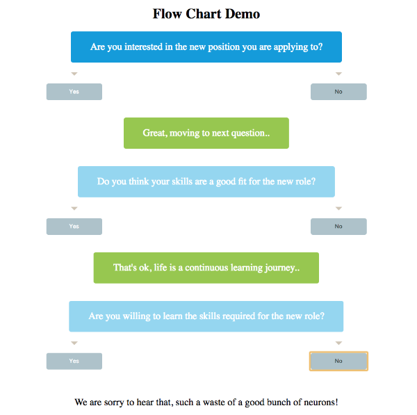

# jQuery Simple Flowchart

I created this plugin because I needed to add an interactive decision tree / flowchart and the existing solutions didn't suit my needs.

## Features

* Lightweight: around ~150 line of code
* Use CSS for styling (following BEM)
* Options for animation and automatic scrolling
* Support different node types:
  * Question with ability to add any number of answers
  * Informative node with link
  * Final link
* Full control on the used classes
* Ability to define custom class per node / answer

## Usage

### Package Managers

```sh
# NPM
npm install simpleflowchart.jquery

# YARN
yarn add simpleflowchart.jquery
```

### Using the files

Include the script after jQuery like the following

```html
<script src="path/to/jQuery.js"></script>
<script src="simpleflowchart.jquery.js"></script>
```

Include the CSS file in your `<head>` (not required but can provide a good starting point for you to style from)

```html
<link rel="stylesheet" src="simpleflowchart.jquery.css" />
```

Add the element that will host the chart then initialize the plugin

```html
<div class="chart">
  <!-- It's a good practice to include an alternative version for the chart like an image or a link to a pdf file for users without JavaScript or in case the script failed to execute for any reason -->
</div>
<script>
  $('.chart').simpleflowchart(options);
</script>
```

## Options

Option | Type | Default | Description
------ | ---- | ------- | -----------
data | array | [] | The data used to construct the tree. See the section [`Data format`](#data-format) for more details.
wrapperClass | string | `chart-wrapper` | The class used for the wrapper that contain the chart.
startClass | string | `node__start` | The class used for the starting node in the chart.
informativeClass | string | `node__informative` | The class used for the informative nodes in the chart.
nodeClass | string | `node__question` | The class used for the regular nodes in the chart.
finishClass | string | `node__finish` | The class used for the final node in the chart.
startingPoint | integer | `1` | The id of the starting node in the chart.
animated | boolean | `true` | Option to animate adding / removing nodes from the chart.
easingSpeed | integer | `300` | The speed by nodes are added / removed from the chart. This option works only if `easingSpeed` is set to `true`.
scrollToNewNode | boolean | `true` | Option to automatically scroll to newly created nodes. This is useful when the chart grows it automatically scroll so that the user can see the new parts.
scrollSpeed | integer | `800` | The speed by which the page scroll to the newly created nodes. This option works only if `scrollToNewNode` is set to `true`.

## Data format

Data should be supplied to the plugin as an array of objects. Below are the list of properties that should be used:

Property | Type | Required | Description
------ | ---- | ------- | -----------
`id` | integer | yes | The identifier for each node. This property is used for linking between the different nodes in the chart.
`text` | string | yes | The text that will be displayed for this node.
`answers` | array | no | List of the answers that the user can click to navigate to the next node. Each answer is an object that can have three properties: `link`, `text`, `class`. Check [Answer format](#answer-format) for more details
`start` | boolean | no | Set the node type to `start` and add the class defined by the option `startClass`.
`finish` | boolean | no | Set the node type to `finish` and add the class defined by the option `finishClass`.
`informative` | boolean | no | Set the node type to `informative`. This type of node doesn't have answers, it just display some text and it links to a different node using the property `link`. See the next property for details.
`link` | string | yes when node type is set to `informative` | Should be the `id` of the node that the associated informative node link to.
`class` | string | no | Optional class to be added to that node.

### Answer format

Answers is an array of object. Below are the list of properties that should be used:

Property | Type | Required | Description
------ | ---- | ------- | -----------
`link` | integer | yes | Should be the `id` of the node the user should see when he click that answer.
`text` | string | yes | The text that will be displayed for this node.
`class` | string | no | Optional class to be added to that answer button.

### Example

```json
  [
    {
      "id": 1,
      "text": "Are you willing to follow this chart till the end?",
      "start": true,
      "answers": [
        {
          "text": "Yes",
          "link": 2,
          "class": "decision-success"
        }, {
          "text": "No",
          "link": 3,
          "class": "decision-error"
        }
      ]
    }, {
      "id": 2,
      "text": "Good, now check the next node.",
      "informative": true,
      "link": 4
    }, {
      "id": 3,
      "text": "OK, have a nice day",
      "finish": true,
    }, {
      "id": 4,
      "text": "Now answer the following questions",
      "answers": [
        ...
      ]
    }
  ]
```

### Full Example


## Events

Events are callbacks that execute in response to different actions like click a decision, before or after drawing a node ... etc. To be added in the upcoming versions

## Methods

Methods are called on the chart instances through the simpleflowchart method itself. To be added in the upcoming versions.

## Dependencies

jQuery 2.0+, 3.0+
